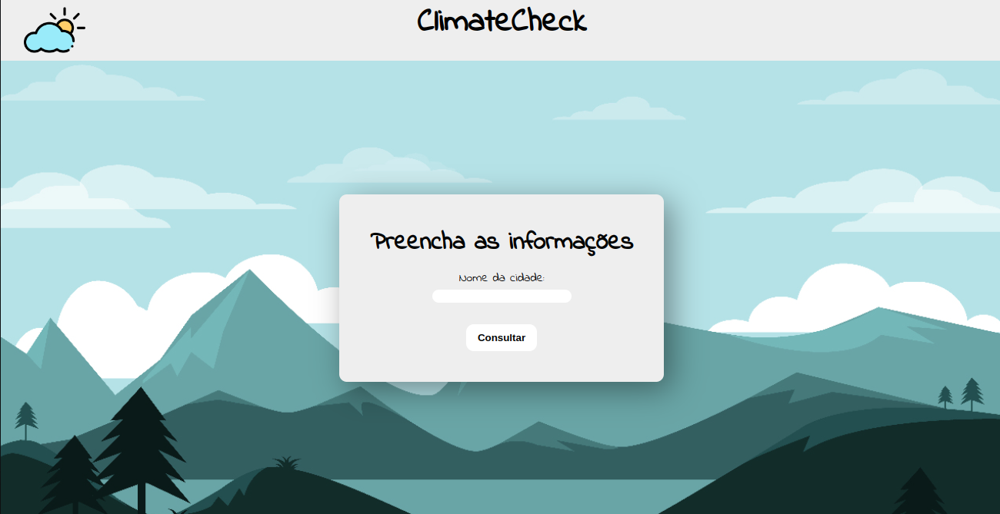
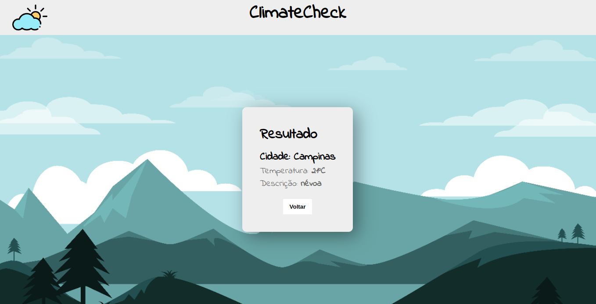

<h1 align=center>🌄ClimateCheck🌄</h1>
<br>

<h2 align=center>Sobre o Projeto</h2>
<p>Fizemos este site simples e direto ao objetivo, aonde seu objetivo é um usuário preencher o campo cidade de depois retornar com o clima da cidade e a descrição do tempo atual.</p>
<br>


<h2 align=center>⏹Demonstração⏹</h2>




<h2 align=center> API </h2>
<p>Para saber o clima das cidades foi necessário utilizar uma API. A API que nós utilizamos foi OpenWeather, com ela conseguimos bastante informações sobre uma determinada cidade. Além da descrição e a temperatura atual ela pode te dar outras informações como: temperatura máxima, temperatura mínima etc.</p>
<a href="https://openweathermap.org/api">API Openweather</a><br><br>


<h2 align=center>🧰Tecnologias🧰</h2>
<p style="text-align:center;">Tecnologias que foram utilizadas para realizar o projeto:</p>
<a style="font-size:20px;" href="https://pt.wikipedia.org/wiki/Python">Python</a><br>
<a style="font-size:20px;" href="https://flask.palletsprojects.com/en/2.3.x/">Flask</a><br>
<a style="font-size:20px;" href="https://pt.wikipedia.org/wiki/HTML">HTML</a><br>
<a style="font-size:20px;" href="https://pt.wikipedia.org/wiki/<br>Cascading_Style_Sheets">CSS</a><br><br>


<h2 align=center>📑Tutorial como Executar📑</h2>

<p>Para fazer as etapas abaixo é necessário que você te instalado em seu computador Python e Visual Studio Code.</p>

```bash

# Clone este repositório pelo terminal/cmd
$ git clone https://github.com/Kaue-Francisco/ClimateCheck.git

# Acesse a pasta do projeto onde você clonou
$ cd ClimateCheck

# Abra a pasta no VSCode
$ code .

# Logo após acesse o terminal do VSCode e instale as bibliotecas
$ pip install flask

# E depois
$ pip install request

# Execute a aplicação localmente
$ python3 main.py

# Muito provavelmente aplicação estará disponível pelo endereço http://127.0.0.1:5000

```

---

## 📝 Licença

Esse projeto está sob a licença MIT. Veja o arquivo [LICENSE](LICENSE) para mais detalhes.

#

<div align=center>Feito por Kauê Francisco & Gabriel Philipe</div>